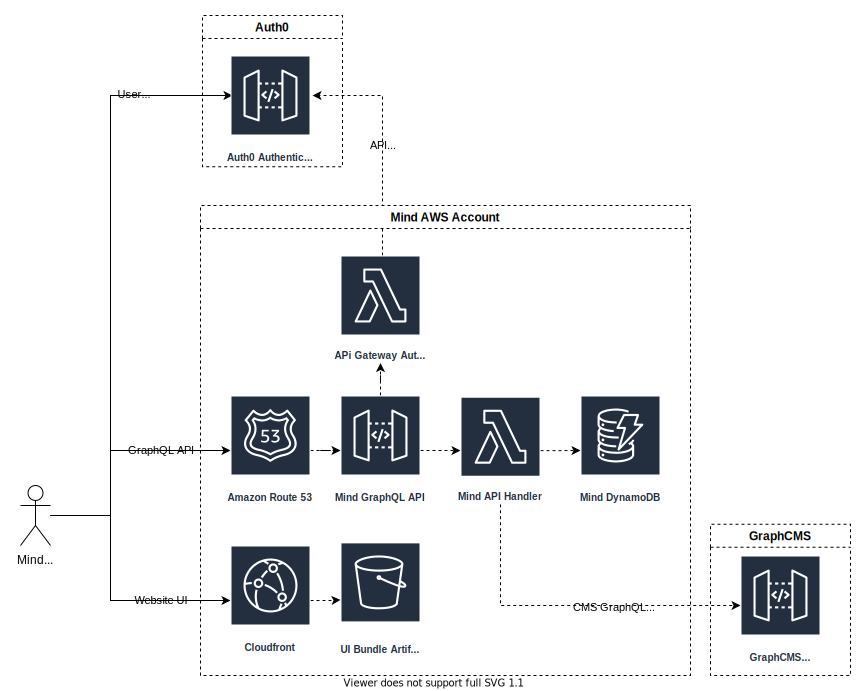

# Mind Hub UI

> Mind Hub UI is a prototype project created in collaboration with the charity Mind In Salford. Mind Hub allowed the charities users to be able to access mindfulness courses and track their progress.

## Architecture

## Setup

- Clone the project from Github
  - `git clone git@github.com:jdpx/mind-hub-ui.git`
- Install dependancies
  - `yarn install`
- Add local development URL to host file
  - `sudo nano /etc/hosts`
  - Add `127.0.0.1 local.mind.jdpx.co.uk` to file
- Add a `.env` file to the project root with the following variables. Ask for the values
  - HTTPS=true
  - HOST=local.mind.jdpx.co.uk
  - REACT_APP_AUTH0_DOMAIN={{AUTH_0_DOMAIN}}
  - REACT_APP_AUTH0_CLIENT_ID={{AUTH_0_CLIENT_ID}}
  - REACT_APP_API_URL=http://localhost:8080/v1/query

## Related Repos

- [Mind API](https://github.com/jdpx/mind-hub-api)

## Development

- Ensure the API is running
  - See [link](https://github.com/jdpx/mind-hub-api)
- Run application locally
  - `yarn start`

## Commands

- Run Linter
  - `yarn lint`
- Run Tests
  - `yarn test/run`
  